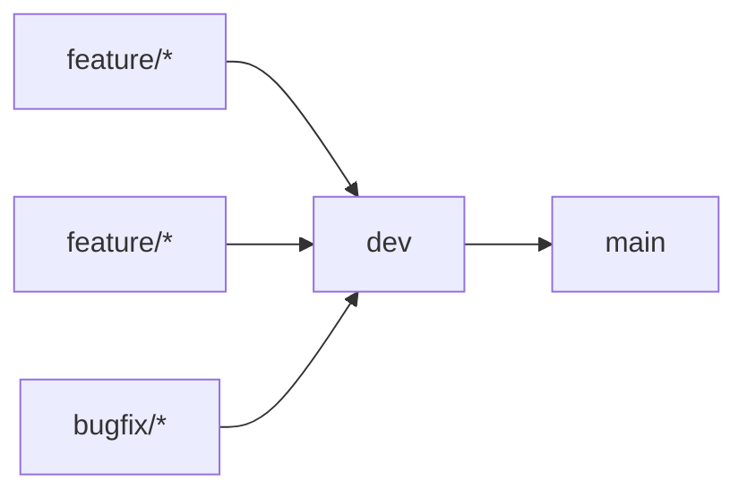

# Clippy Frontend

   

This is repository contains code for frontend of project [Clippy: smart PDF reader for better paper reading experience and knowledge mining](https://conf.researchr.org/track/icse-2023/icse-2023-score-2023#clippy:-smart-pdf-reader-for-better-paper-reading-experience-and-knowledge-mining). 

## Contents

 - [Application](#application)
	 - [Tools](#tools)
	 - [Libraries](#libraries)
 - [Development](#development)
	 - [Branching](#branching)
	 - [Local](#local)
 - [Hosting](#hosting)
	 - [Heroku](#heroku)
	 - [Environments](#environments)
	 - [Variables](#variables)

## [Application](#application)
### [Tools](#tools)

- Git for version control.
- [Zenhub](https://app.zenhub.com/workspaces/clippy-63600767a63c240a624ccea7/board) in addition to GitHub board for tracking work items and SCRUM organisation.
- [SonarCloud](https://sonarcloud.io/project/overview?id=clippydsdone_clippy-frontend) for code quality check.

### [Libraries](#libraries)

- [PDF.js](https://mozilla.github.io/pdf.js/): A general-purpose, web standards-based platform for parsing and rendering PDFs. Consult with our [wiki](https://github.com/clippydsdone/clippy-frontend/wiki/PDF.js) when developing with PDF.js.
- [D3.js](https://d3js.org): D3.js is a JavaScript library for manipulating documents based on data. D3 helps you bring data to life using HTML, SVG, and CSS. D3’s emphasis on web standards gives you the full capabilities of modern browsers without tying yourself to a proprietary framework, combining powerful visualization components and a data-driven approach to DOM manipulation.
- [Citation.js](https://citation.js.org): Citation.js (GitHub, NPM) converts formats like BibTeX, BibJSON, DOI, and Wikidata to CSL-JSON to convert to styles like APA, Vancouver and to BibTeX and RIS.

# [Development](#development)
### [Branching](#branching)

There are only 2 long-standing (remote) branches:

1. **dev**: Contains all the code in the current SCRUM iteration.
2. **main**: Contains the release for the previous SCRUM iteration.

There are only 2 types of temporary branches:

1. **feature/(IssueId)-(issue-name)**: Contains current work being developed for the Issue. Example of valid feature branch name for issue `Setup repo and wiki` with ID `22` would be `feature/22-setup-repo-and-wiki`
2. **bugfix/(IssueId)-(issue-name)**: Contains current work being developed for the Issue of type `Bug`. Example of valid feature branch name for issue `PDF.js not rendering` with ID `42` would be `bugfix/42-pdf-js-not-rendering`

When issues are closed temporary branches are **squashed and deleted**.

### [Local](#local)
- To test application locally install [PHP server](https://windows.php.net/download#php-8.1) and put the installation files in your local environment so you can run the commands from the powershell. Then run `php -S localhost:8000` to test your code locally as it is in the Heroku enivornment. 

## [Hosting](#hosting)
### [Heroku](#heroku)
Clippy respository is setup for hosting to [Heroku](https://dashboard.heroku.com) with heroku/php buildpack. 
### [Environments](#environments)
There are two Clippy hosting environments: 

 - Development: Environment that is hosted from the dev branch and PRs.
 - Production: Environment that is hosted from the main branch (release).

### [Variables](#variables)
All environment variables needed for hosting Clippy are defined in GitHub secrets.
| Keys | Description |
|--|--|
|  `HEROKU_API_KEY`|  API key for the Heroku container that application is deployed to.|
|  `HEROKU_APP_NAME`|  Name of the Heroku container that application is deployed to. (PRODUCTION)|
|  `HEROKU_APP_NAME_DEV`| Name of the Heroku container that application is deployed to. (DEVELOPMENT)|
|  `SONAR_TOKEN`| Token for SonarCloud service. |
