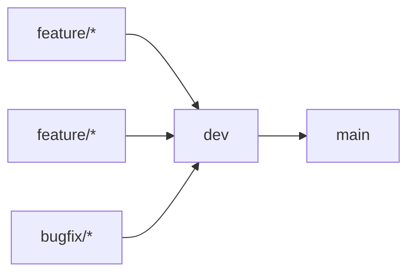

# Clippy Frontend

This is repository contains code for frontend of project [Clippy: smart PDF reader for better paper reading experience and knowledge mining](https://conf.researchr.org/track/icse-2023/icse-2023-score-2023#clippy:-smart-pdf-reader-for-better-paper-reading-experience-and-knowledge-mining). 

## Tools & platforms

- Git for version control.
- [Zenhub](https://app.zenhub.com/workspaces/clippy-63600767a63c240a624ccea7/board) in addition to GitHub board for tracking work items and SCRUM organisation.
- [SonarCloud](https://sonarcloud.io/project/overview?id=clippydsdone_clippy-frontend) for code quality check.

## Branching Strategy

There are only 2 long-standing (remote) branches:

1. **dev**: Contains all the code in the current SCRUM iteration.
2. **main**: Contains the release for the previous SCRUM iteration.

There are only 2 types of temporary branches:

1. **feature/(IssueId)-(issue-name)**: Contains current work being developed for the Issue. Example of valid feature branch name for issue `Setup repo and wiki` with ID `22` would be `feature/22-setup-repo-and-wiki`
2. **bugfix/(IssueId)-(issue-name)**: Contains current work being developed for the Issue of type `Bug`. Example of valid feature branch name for issue `PDF.js not rendering` with ID `42` would be `bugfix/42-pdf-js-not-rendering`

When issues are closed temporary branches are **squashed and deleted**.

## CI/CD

## GitFlow

## 
