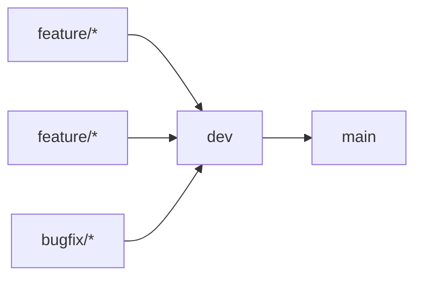

# Clippy Frontend

This is repository contains code for frontend of project [Clippy: smart PDF reader for better paper reading experience and knowledge mining](https://conf.researchr.org/track/icse-2023/icse-2023-score-2023#clippy:-smart-pdf-reader-for-better-paper-reading-experience-and-knowledge-mining). 

## Tools & platforms

- Git for version control.
- [Zenhub](https://app.zenhub.com/workspaces/clippy-63600767a63c240a624ccea7/board) in addition to GitHub board for tracking work items and SCRUM organisation.
- [SonarCloud](https://sonarcloud.io/project/overview?id=clippydsdone_clippy-frontend) for code quality check.

---------------------------
## Branching Strategy

There are only 2 long-standing (remote) branches:

1. **dev**: This contains all the code in the current SCRUM itteration.
2. **main**: Contains the release for the previous SCRUM itteration.

## CI/CD

## GitFlow

## 
